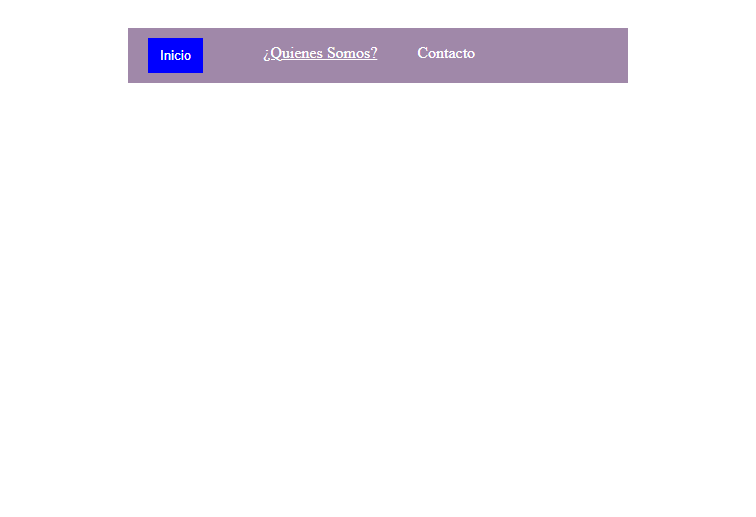

<h1>Taller 9 - Juan Mateo Zambrano Alvarez</h1>

<h2>Informacíon</h2>

Curso: Full Stack Basico - Gupo 1 

Profesor: Cristian patiño

<h2>Link de la pagina web</h2>

<h2>punto 1: Link Figma</h2>
<a href="https://www.figma.com/file/Fw8uwBM8X9GisgJXJLVsuW/Mateo-Zambrano?type=design&node-id=1706-2&mode=design&t=RDnmRX8vpoLPZnlR-4">Link de Figma</a>

<h2>punto 2: Diseño en HTML </h2>

<h2>punto 3: Diseño con cSS </h2>

<h2>punto 4: Titulos</h2>

<h2>punto 5: Parrafo</h2>

<h2>punto 6: Links</h2>

<h2>punto 7-8: Navegación</h2>

<h2>punto 9: Tabla</h2>
